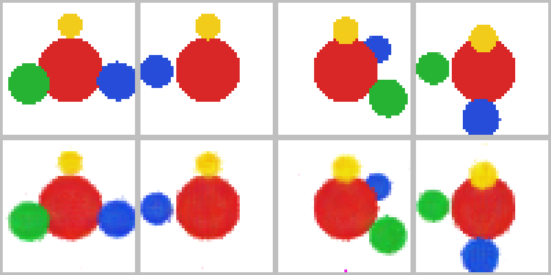

# nerf-replication

A from-scratch PyTorch replication of *NeRF: Representing Scenes as Neural
Radiance Fields for View Synthesis* (Mildenhall et al., ECCV 2020,
[arXiv:2003.08934](https://arxiv.org/abs/2003.08934)).

The goal is to reimplement the method without copying the reference code,
train it on the paper's synthetic Lego scene, and compare my numbers with the
published ones.

## Status

In progress. The pipeline now trains end to end on a small synthetic scene.
It has not been trained on the paper's data yet, so there is nothing to
compare with the paper.

| Part | Paper | Status |
| --- | --- | --- |
| Camera rays | Section 4 | Implemented, tested |
| Positional encoding | Section 5.1, Eq. 4 | Implemented, tested |
| Stratified sampling | Section 4, Eq. 2 | Implemented, tested |
| Volume rendering | Section 4, Eqs. 1 and 3 | Implemented, tested |
| Network | Section 3, Fig. 7 | Implemented, tested |
| Hierarchical sampling | Section 5.2 | Implemented, tested |
| Training loop | Section 5.3, Eq. 6 | Implemented, tested on an analytic scene |
| Loader for the paper's synthetic scenes, and a camera check | Section 6.1 | Implemented, tested |
| Lego scene: PSNR, SSIM, LPIPS against the paper | Section 6 | Next |
| Mesh extraction from the trained density | not in the paper | Planned |

## First trained result

`scripts/00_smoke_test.py` trains a small network (4 layers of 64 units) for
2000 steps on 24 synthetic 48x48 images of four coloured spheres, then renders
four viewpoints that were not in the training set.



Top row: the true held-out views. Bottom row: the same views rendered by the
trained network. The numbers from the run are in `results/smoke_test.json`.
The script fails if the mean held-out PSNR is below 20 dB; a blank white image
scores about 8.5 dB.

This shows that the pipeline learns a 3D scene from 2D images alone. It is not
a replication result. The training images come from this repository's own
renderer applied to a scene with known density and colour, and the network and
sample counts are far smaller than the paper's so that the run takes a couple
of minutes on a laptop CPU.

## Data

The paper's synthetic Lego scene comes from the example archive that the
authors' own download script fetches:

```
mkdir -p data
curl -L -o data/nerf_example_data.zip http://cseweb.ucsd.edu/~viscomp/projects/LF/papers/ECCV20/nerf/nerf_example_data.zip
unzip -q data/nerf_example_data.zip -d data
python scripts/01_check_dataset.py data/nerf_synthetic/lego
```

The last command trains nothing. It checks that the dataset's cameras mean
what this code assumes: that every camera looks at the origin down its own -z
axis with world +z up, and that carving a grid with the silhouettes of all
training views leaves a visual hull which projects back onto those
silhouettes. It writes its numbers to `results/dataset_check.json`.

## What is here

- `src/nerf/rays.py`: the camera model. One ray per pixel from a camera pose,
  and the reverse, from a 3D point to the pixel it appears at.
- `src/nerf/encoding.py`: positional encoding of positions and directions.
- `src/nerf/model.py`: the network, from position and viewing direction to
  density and colour.
- `src/nerf/render.py`: stratified sampling, the quadrature of the volume
  rendering integral, importance sampling from the coarse weights, the
  two-pass coarse-then-fine rendering of a batch of rays, and rendering of
  whole images.
- `src/nerf/data.py`: the container for posed images, the loader for the
  paper's synthetic scenes, camera pose helpers and the analytic sphere scene.
- `src/nerf/train.py`: the training loop, its hyperparameters and evaluation
  by PSNR.
- `src/nerf/hull.py`: space carving. The visual hull of a scene from its
  silhouettes, used to check cameras without training.
- `scripts/00_smoke_test.py`: the end-to-end run described above.
- `scripts/01_check_dataset.py`: the dataset check described above.
- `tests/`: unit tests for the seven modules.

## How it is checked

**Renderer.** The rendering integral is the emission-absorption case of
radiative transfer, so the renderer can be tested against closed-form answers
and not only for tensor shapes:

- a uniform slab crossed at an angle absorbs exactly `1 - exp(-sigma * path)`
  (Beer-Lambert);
- for a density that rises linearly along the ray, the transmitted fraction
  converges to the analytic `exp(-tau)`, with the error falling by about four
  each time the number of samples is quadrupled, as expected of a first-order
  rule;
- for random densities, sample positions and ray lengths, the weights sum to
  `1 - exp(-optical depth)`;
- an opaque surface returns its own colour and depth, and nothing behind it
  contributes;
- empty space renders as the background.

**Network.** The layer sizes are those of Fig. 7, which add up to 595,844
parameters per network. Density does not change when the viewing direction
does, and colour does.

**Hierarchical sampling.** The network is replaced by an analytic opaque wall,
so the right answer is known:

- samples drawn from a set of weights occur with frequencies proportional to
  those weights, and are uniform inside each bin;
- the importance samples land in the bin where the coarse pass found the wall,
  and the fine pass puts the surface closer to its true depth than the coarse
  pass does;
- a loss on the fine render sends no gradient into the coarse network.

**Training loop.**

- every ray is paired with the colour of its own pixel, checked on a
  non-square image whose colours encode pixel coordinates;
- two steps of the loop end at the same weights as two steps written out by
  hand, and both networks are updated;
- putting the exact analytic scene where the trained networks would go, the
  evaluation code gives back the training images, which ties together the
  poses, focal length, bounds and background used at evaluation time;
- the loss falls over a short run.

**Data and cameras.**

- a scene written to disk in the dataset's format is read back exactly:
  poses, focal length, straight-alpha compositing over white, and
  area-averaged downscaling done on RGBA before compositing;
- a point on the ray through a pixel projects back to that pixel;
- on the analytic scene the visual hull contains the interior of every sphere
  and projects back onto the silhouettes with an intersection over union
  above 0.95 in every view;
- deliberately wrong cameras are caught: inverted poses or OpenCV-style axes
  leave an empty hull, and mirrored or upside-down images drop the
  intersection over union below 0.8.

## Where this follows the released code and not the paper

The paper and the authors' code ([bmild/nerf](https://github.com/bmild/nerf))
disagree in a few places. Since the published numbers came from the code, I
follow the code:

1. **Positional encoding.** Eq. 4 has `sin(2^k pi p)`. The code uses
   `sin(2^k p)` with no factor of pi, and also concatenates the raw input.
2. **Stratified sampling.** Eq. 2 splits the ray into N equal bins. The code
   places N evenly spaced points, including both ends, and jitters each one
   between the midpoints to its neighbours, so the two end bins are half width.
3. **Ray parameter.** Ray directions are not normalised. `t` measures depth in
   front of the camera, so near and far are planes, and the renderer multiplies
   by the length of the direction to get distances.
4. **Last sample.** The final sample on each ray is given an effectively
   infinite interval, so any density there is fully opaque.
5. **Hierarchical sampling.** The importance samples are drawn from bins whose
   edges are the midpoints between coarse samples, using the weights of the
   interior coarse samples only. The first and last coarse weights are dropped.
6. **Batch size.** Section 5.3 says 4096 rays per step. The released
   configuration for the paper's synthetic results
   (`paper_configs/blender_config.txt`) uses 1024.
7. **Training length.** Section 5.3 says 100-300k iterations. The same
   configuration file says it reproduces the Lego result when trained to 500k
   iterations, and its learning rate falls by a factor of 10 every 500k steps,
   which gives the paper's 5e-4 to 5e-5 only over a 500k run.

One more choice is inherited from the code and is not stated in the paper:
the network is initialised Glorot-uniform with zero biases, the default of the
TensorFlow layers the authors used. PyTorch's default is different.

## Setup

```
python -m venv venv
source venv/bin/activate
pip install -e ".[dev]"
python -m pytest -q
python scripts/00_smoke_test.py
```

On an Apple Silicon Mac, create the environment from a native arm64 Python.
An Intel build of Python running under Rosetta can only install PyTorch 2.2.2,
the last release with Intel macOS wheels, and that release predates NumPy 2.

## Reference

B. Mildenhall, P. P. Srinivasan, M. Tancik, J. T. Barron, R. Ramamoorthi and
R. Ng. NeRF: Representing Scenes as Neural Radiance Fields for View Synthesis.
ECCV 2020.
