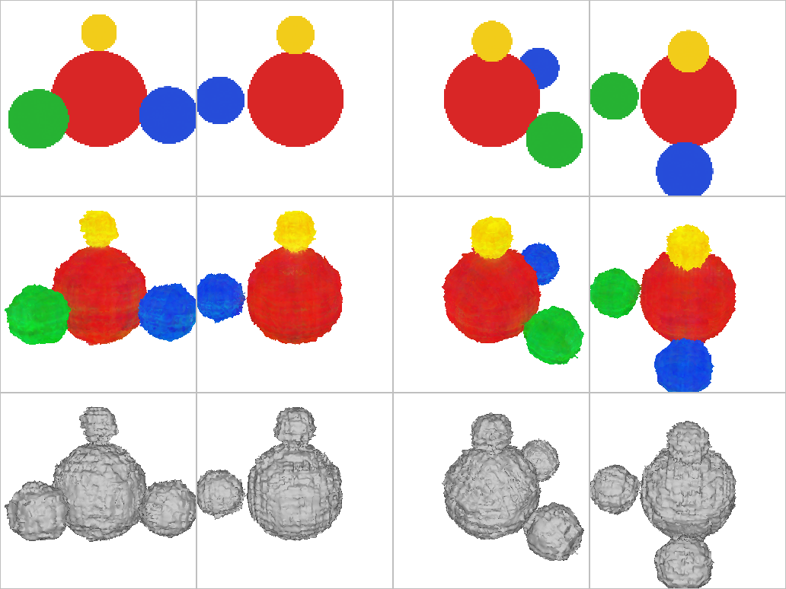
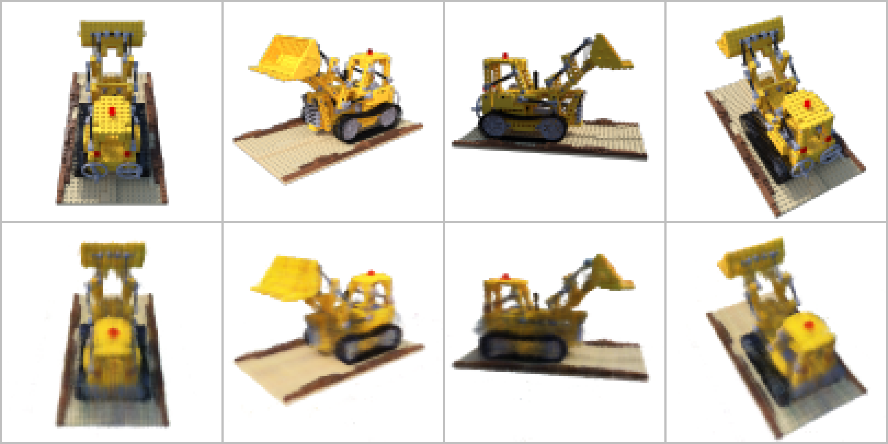

# nerf-replication

A from-scratch PyTorch replication of *NeRF: Representing Scenes as Neural
Radiance Fields for View Synthesis* (Mildenhall et al., ECCV 2020,
[arXiv:2003.08934](https://arxiv.org/abs/2003.08934)).

The goal is to reimplement the method without copying the reference code,
train it on the paper's synthetic Lego scene, and compare my numbers with the
published ones.

## Status

In progress. The pipeline trains end to end on a small synthetic scene. On the
paper's Lego scene, a first short run at 1/8 resolution (2,060 steps on a
laptop GPU) scores PSNR 23.84 dB, SSIM 0.855 and LPIPS 0.136 on 25 test views.
That shows training and scoring at work and is not yet a number to set against
the paper's. The same training runs as an Amazon SageMaker job, where it
reproduces the laptop's loss. A trained model can be turned into a coloured
triangle mesh, which is checked against the scene's photographs. The
full-resolution run has not finished yet, so there is nothing to compare with
the paper.

| Part | Paper | Status |
| --- | --- | --- |
| Camera rays | Section 4 | Implemented, tested |
| Positional encoding | Section 5.1, Eq. 4 | Implemented, tested |
| Stratified sampling | Section 4, Eq. 2 | Implemented, tested |
| Volume rendering | Section 4, Eqs. 1 and 3 | Implemented, tested |
| Network | Section 3, Fig. 7 | Implemented, tested |
| Hierarchical sampling | Section 5.2 | Implemented, tested |
| Training loop | Section 5.3, Eq. 6 | Implemented, tested on an analytic scene |
| Loader for the paper's synthetic scenes, and a camera check | Section 6.1 | Implemented, tested; Lego passes |
| Training script with checkpoints and exact resume | | Implemented, tested |
| Launcher for Amazon SageMaker training jobs | | Implemented, tested; CPU jobs run on AWS, GPU run pending |
| PSNR, SSIM and LPIPS on the test views | Section 6 | Implemented, tested |
| Lego at full resolution: scores against the paper | Table 4 | Next |
| Mesh extraction from the trained density | not in the paper | Implemented, tested on known geometry |
| Lego mesh from the full-resolution model | not in the paper | Next |

## First trained result

`scripts/00_smoke_test.py` trains a small network (4 layers of 64 units) for
2000 steps on 24 synthetic 48x48 images of four coloured spheres, then renders
four viewpoints that were not in the training set.


Top row: the true held-out views. Bottom row: the same views rendered by the
trained network. The numbers from the run are in `results/smoke_test.json`.
The script fails if the mean held-out PSNR is below 20 dB; a blank white image
scores about 8.5 dB.

The same run then turns the trained network into a triangle mesh (see Mesh
below) and measures the mesh against the spheres, whose surface is known
exactly.



Top row: the true held-out views. Middle row: the mesh, in the colours the
network gives it. Bottom row: the shape of the mesh, lit from the camera.

Four things are measured from the held-out viewpoints, and the script fails
if the mesh misses any of them: its outline overlaps the true outline by at
least 0.92 (intersection over union); the points of it that the cameras see
are on average within 0.04 of the true surface; it encloses the spheres'
volume to within 20 %; its colours are on average within 0.10 of the true
views'. For scale, the largest sphere has radius 0.7, the mesh is taken from a
grid with cells of 0.025, and one pixel of the 48x48 training images covers
0.06 at the spheres' distance.

Two meshes that need no training are measured the same way, to say what those
numbers are worth:

| Mesh | Outline IoU | Mean distance to the true surface | Volume, true = 1 |
| --- | --- | --- | --- |
| From the trained network | about 0.95 | about 0.02 | about 0.9 |
| Visual hull carved from the 24 training outlines | 0.962 | 0.0156 | 0.93 |
| The scene's exact density on the same grid | 0.983 | 0.0035 | 1.00 |

The last two rows involve no training and come out the same on every run. The
first depends on the run, so it is given roughly; `results/smoke_test.json`
has the numbers of the run pictured. In the runs made so far the network's
mesh lay, on balance, a little inside the true surface, by a fraction of a
grid cell. Mesh below says where that comes from.

The hull does as well as the network's mesh here. Spheres are convex, so
their outlines already say nearly everything about them, and this scene cannot
show what a NeRF adds to a hull, which is the surface inside the outline. What
it does show is that training, meshing and measuring work together, and how
close a mesh from a network this small comes to a surface that is known. (A
hull encloses its object, yet this one has less than the spheres' volume. It
is carved from outlines only 48 pixels across by looking up the nearest pixel,
which can shave up to half a pixel off it, and some training views crop the
outer spheres.)

The run as a whole shows that the pipeline learns a 3D scene from 2D images
alone. It is not a replication result. The training images come from this
repository's own renderer applied to a scene with known density and colour,
and the network and sample counts are far smaller than the paper's so that
the run takes a couple of minutes on a laptop CPU.

## Data

The paper's synthetic Lego scene comes from the example archive that the
authors' own download script fetches:

```
mkdir -p data
curl -L -o data/nerf_example_data.zip http://cseweb.ucsd.edu/~viscomp/projects/LF/papers/ECCV20/nerf/nerf_example_data.zip
unzip -q data/nerf_example_data.zip -d data
python scripts/01_check_dataset.py data/nerf_synthetic/lego
```

The last command trains nothing. It checks that the dataset's cameras mean
what this code assumes: that every camera looks at the origin down its own -z
axis with world +z up, and that carving a grid with the silhouettes of all
training views leaves a visual hull which projects back onto those
silhouettes. It writes its numbers to `results/dataset_check.json`.

On Lego every check passes. All 100 training cameras are 4.0311 from the
origin and look at it to within 0.04 degrees. The hull spans x from -0.60 to
0.60, y from -1.10 to 1.12 and z from -0.51 to 0.98, and it projects back onto
the silhouettes with a mean intersection over union of 0.935 (worst view
0.916). For comparison, on the analytic test scene mirrored or upside-down
images score about 0.7, and the check requires 0.8.

## Training

```
python scripts/02_train.py data/nerf_synthetic/lego --out runs/lego_100px --downscale 8 --iterations 1000
```

Without `--downscale` and `--iterations` this is the released paper
configuration: 800x800 images, 1024 rays per step, 64 coarse and 128 fine
samples per ray, 500k steps. The run directory receives the settings, a log,
a validation image and PSNR at intervals, and a checkpoint. Running the same
command again resumes from the checkpoint, and a stop request (Ctrl-C, or the
termination signal of a job scheduler) lets the current step finish and saves
first, so an interrupted run follows exactly the same path as an uninterrupted
one. Every 50,000 steps the checkpoint is also kept under a name of its own
(`--keep-every`), so that the run can be scored afterwards at several points
of its training. Run directories are not committed.

### As an Amazon SageMaker training job

At about 1.4 steps per second on a laptop GPU, 500k steps take four days.
`scripts/03_sagemaker.py` runs the same script on a rented GPU machine:

```
python3 scripts/03_sagemaker.py launch benchmark
python3 scripts/03_sagemaker.py launch full --max-hours 24
python3 scripts/03_sagemaker.py status
python3 scripts/03_sagemaker.py stop
```

`benchmark` is the first 2,000 steps of the paper configuration, to see that
the job runs and how fast. `full` is all 500k steps. The job is described in
`src/nerf/sagemaker.py`:

- **Container.** AWS's prebuilt PyTorch 2.10 training image. Nothing is
  installed when the job starts.
- **Program.** `python3 -u 02_train.py` with the same arguments as a local
  run, plus `--device cuda`, so that a job which cannot see its GPU fails at
  once.
- **Code.** The script and the `nerf` package are uploaded to S3 for each job
  and mounted as an input channel. The script sits next to the package, so
  nothing has to be installed. The upload is the record of what the job ran,
  and the job is tagged with the git commit.
- **Data.** The scene directory in S3 is a second input channel.
- **Run directory.** The script's `--out` directory is the job's checkpoint
  directory, which SageMaker copies to S3 while the job runs and restores when
  a later job names the same location. Jobs with the same `--run` name
  therefore continue one another: `full` picks up where `benchmark` ended, and
  a job that was stopped or reached its time limit is continued by launching
  it again.
- **Cost limit.** Every job has a time limit, after which SageMaker stops it.
  The stop signal reaches the script directly, which finishes its step and
  saves a checkpoint.

One-time setup, in region us-east-1, from a machine with the AWS CLI and the
scene:

```
ACCOUNT=$(aws sts get-caller-identity --query Account --output text)
BUCKET=sagemaker-us-east-1-$ACCOUNT
aws s3 mb s3://$BUCKET --region us-east-1
aws s3 sync data/nerf_synthetic/lego s3://$BUCKET/nerf/data/lego --only-show-errors
aws iam create-role --role-name nerf-sagemaker-role --assume-role-policy-document '{"Version":"2012-10-17","Statement":[{"Effect":"Allow","Principal":{"Service":"sagemaker.amazonaws.com"},"Action":"sts:AssumeRole"}]}'
aws iam attach-role-policy --role-name nerf-sagemaker-role --policy-arn arn:aws:iam::aws:policy/AmazonSageMakerFullAccess
```

The bucket name has to contain "sagemaker": the `AmazonSageMakerFullAccess`
policy lets the job read and write objects only in buckets named that way.
The launcher itself needs `boto3` and AWS credentials but not PyTorch. AWS
CloudShell, the terminal in the AWS console, has both.

#### First jobs on AWS

Two jobs have run so far, both on a CPU machine (`ml.m5.xlarge`), on the Lego
scene at 1/8 resolution with the paper's network and sampling:

```
python3 scripts/03_sagemaker.py launch benchmark --instance-type ml.m5.xlarge --run lego-100px-cpu --iterations 100 --extra="--downscale 8 --log-every 10"
python3 scripts/03_sagemaker.py launch benchmark --instance-type ml.m5.xlarge --run lego-100px-cpu --iterations 120 --extra="--downscale 8 --log-every 10"
```

The first trained 100 steps and left its run directory in S3. The second was
launched under the same run name, so SageMaker restored that directory and the
script continued from step 100. This is the launcher's output from the moment
that job started, with the account number removed:

```
Started job nerf-lego-100px-cpu-20261007-184016
  machine     ml.m5.xlarge, stopped automatically after 45 min
  program     python3 -u 02_train.py /opt/ml/input/data/training --out /opt/ml/checkpoints --iterations 120 --validate-every 1000 --checkpoint-every 500 --device cpu --downscale 8 --log-every 10
  results     s3://sagemaker-us-east-1-<account>/nerf/runs/lego-100px-cpu/out
  to stop it  python3 /home/cloudshell-user/nerf-replication/scripts/03_sagemaker.py stop
Following the job. Control-C stops following; the job itself keeps running.
[18:40:17 UTC] Starting: Starting the training job
[18:40:17 UTC] Starting: Preparing the instances for training
[18:42:58 UTC] Downloading: Downloading input data
[18:42:58 UTC] Downloading: Downloading the training image
[18:44:14 UTC] Training: Training image download completed. Training in progress.
100 training views at 100 x 100, 4 validation views, device cpu, torch 2.10.0+cpu
resumed from /opt/ml/checkpoints/checkpoint.pt at step 100
step     110  loss 0.05518  train PSNR 15.67 dB    0.12 steps/s  about 1.4 min left
step     120  loss 0.05505  train PSNR 15.94 dB    0.12 steps/s  about 0.0 min left
step     120  validation PSNR 16.54 dB  -> val_000120.png
finished at step 120: mean PSNR on 4 validation views 16.03 dB, 20.4 min of training in total
results are in /opt/ml/checkpoints
[18:50:16 UTC] Uploading: Uploading generated training model
[18:50:19 UTC] Completed: Training job completed

job      nerf-lego-100px-cpu-20261007-184016
status   Completed (Completed)
machine  ml.m5.xlarge, time limit 45 min
billed   7.3 min
results  s3://sagemaker-us-east-1-<account>/nerf/runs/lego-100px-cpu/out
```

The job on AWS computes the same thing as a local run. With the same seed, at
step 100:

| | Laptop GPU (MPS, PyTorch 2.14.1) | SageMaker `ml.m5.xlarge` (CPU, PyTorch 2.10.0) |
| --- | --- | --- |
| Loss | 0.05542 | 0.05530 |
| Train PSNR | 16.05 dB | 16.07 dB |
| Steps per second | 1.34 | 0.12 |

The two jobs were billed 19.4 and 7.3 minutes. A CPU machine runs at about a
tenth of the laptop's speed, so these jobs show only that the pipeline works
on AWS. The full-resolution run needs a GPU instance, and the account's quota
for one has been requested.

## Evaluation

```
python scripts/04_evaluate.py data/nerf_synthetic/lego runs/lego_800px/checkpoint.pt
```

This renders the scene's test views, which training never sees, from a
checkpoint and scores each render against the true image with the three
measures of the paper's tables. The paper's protocol for its synthetic scenes
is all 200 test views at 800x800, and each number it reports is the mean over
those views. For Lego (Table 4) it reports PSNR 32.54, SSIM 0.961 and LPIPS
0.050.

The script prints the paper's row next to its own only when it has scored
exactly that. Anything else is labelled as not comparable, in the output and
in `summary.json`. That includes `--skip 8`, which scores every eighth view,
the subset the released code renders by default (`testskip = 8`), and takes an
eighth of the time.

How each number is computed:

- **PSNR.** `-10 log10(MSE)` of each view, on colours in [0, 1], then the mean
  over the views.
- **SSIM.** The released code computes PSNR only, so this is the measure as
  Wang et al. (2004) defined it: an 11x11 Gaussian window with standard
  deviation 1.5, K1 = 0.01 and K2 = 0.03, only windows that lie fully inside
  the image, and the mean over window positions and colour channels.
- **LPIPS.** The reference `lpips` package, version 0.1 of the measure, with
  images scaled to [-1, 1]. The paper does not say which of the LPIPS networks
  it used. I use VGG: [NerfBaselines](https://nerfbaselines.github.io/blender),
  which re-runs published methods under one protocol, lists the paper's value
  as LPIPS (VGG), and its own run of NeRF on Lego gives 0.049 against the
  paper's 0.050.

All three are computed from the render as it comes out of the network, before
it is rounded to 8 bits for the image file. A row of `per_view.csv` is written
as each view finishes, and running the same command again carries on with the
views that are missing, so a long evaluation can be stopped and continued.
Results are tied to what they were computed from: the script refuses to add to
a directory that holds scores of other weights, other cameras, other views or
another image size.

LPIPS needs the ImageNet weights of VGG-16 (528 MB), which torchvision
downloads on first use. They are kept in `data/torch_hub`.

### First scores

The first run on real data: the model from a short Lego run at 1/8 resolution
(2,060 steps on a laptop GPU), scored on every eighth test view.

```
python scripts/04_evaluate.py data/nerf_synthetic/lego runs/lego_100px/checkpoint.pt --skip 8
```

```
25 of 200 test views at 100 x 100, checkpoint at step 2060

              PSNR    SSIM   LPIPS
this run     23.84   0.855   0.136

Not the paper's protocol: 25 of the 200 test views; 100 x 100 images, not 800 x 800.
The paper's numbers for this scene (PSNR 32.54, SSIM 0.961, LPIPS 0.050)
are for all 200 test views at 800 x 800 and cannot be set against these.
```



Top row: four of the true test views. Bottom row: the model's renders of the
same views. As the output says, these numbers are not comparable with the
paper's. They show the three measures working on the real scene, LPIPS with
the real VGG-16 weights included. Rendering took about 3 s per 100x100 view,
so a full 800x800 view will take about 3 minutes on the same laptop. The full
record is `results/lego_100px_step2060_test.json`.

## Mesh

```
python scripts/05_extract_mesh.py data/nerf_synthetic/lego runs/lego_800px/checkpoint.pt
```

A NeRF stores a scene as density and colour throughout space, not as a
surface. This script turns a trained model into a triangle mesh with vertex
colours, the form most 3D tools work with:

1. The fine network's density is sampled on a grid of 257 points per axis
   spanning [-1.2, 1.2], as in the authors' `extract_mesh.ipynb`.
2. Empty pockets that the surface seals off on all sides are filled. In the
   mesh each would be an inner wall that nothing outside can show.
3. Marching cubes (scikit-image's) extracts the surface on which the density
   equals a threshold, as in the notebook.
4. Pieces with less than 1 % of the largest piece's area are dropped. A NeRF
   usually leaves a few specks of density floating in empty space.
5. Every vertex gets the colour the model shows when looked at head-on: a
   short ray along the inward normal, from one grid cell outside the surface
   to three inside, rendered with the same quadrature as an image pixel.

It writes `mesh.ply`, which opens in MeshLab or Blender, a `preview.png` and a
`summary.json`.

**The threshold.** The notebook uses a density of 50 on its example model
(200,000 steps at half resolution), and prints that 3.6 % of the grid lies
above it and that the mesh has 791,052 triangles. How much the choice matters
depends on how sharp the model's surfaces are. Where the density jumps from
zero to hundreds between two neighbouring grid points, the threshold only
moves the surface within that one cell. A small or early model has soft
surfaces, and its mesh swells or shrinks with the threshold by many cells.

So by default the threshold is chosen with the photographs, and only ever
downwards from the authors' 50. For 13 values from 1 to 50 the outline of the
mesh is compared with the object's outline in eight of the training
photographs, and the values that score within 0.01 of the best count as
fitting equally well. If 50 is one of them, it is used. If not, the lowest of
them is: a higher threshold only ever removes material, and a thin or faint
part of the object can vanish whole for a gain in score too small to mean
anything. Nothing above 50 is tried for the same reason. On a model with hard
surfaces the outline score keeps creeping up with the threshold, because the
surface moves inwards within its grid cell, while everything fainter than the
threshold is lost. `--threshold` with a number uses that number whatever the
outlines say.

**Checking a mesh without 3D ground truth.** Nothing tells a NeRF where
surfaces are, so the mesh is scored against photographs the model was not
trained on. A small rasteriser (`rasterise` in `src/nerf/mesh.py`) works out
which triangle each pixel of a test camera sees. The pixels the mesh covers
are compared with the pixels where the photograph shows the object, as
intersection over union: 1 means the two outlines are identical. The same
rasteriser draws the preview: for four test cameras, the photograph, the mesh
in its colours, and the mesh in plain grey to show its shape.

**What that score does not show.** It shows that the mesh is in the right
place, at the right size and with the right outline. It is blind to everything
inside the outline. A dent leaves it unchanged, and a visual hull carved from
the same outlines would score as well as the true surface. A thin part counts
for no more than the few pixels it covers. A part that no camera sees from the
side, such as an underside when every camera looks down from above, does not
enter it at all.

A threshold chosen by outlines shares that blindness, in two ways. A part of
the object that makes up less of the outline than the 0.01 allowed can come or
go without the choice noticing. And the outline of a rough surface is drawn by
the tops of its bumps, so the mesh with the best outline lies, on average,
inside the true surface by about the height of the bumps. Taking the lowest
threshold among those that fit gives some of that back. On the sphere scene of
the smoke test, where the true surface is known, the meshes chosen this way
have still ended up a fraction of a grid cell inside the surface (see First
trained result above; `surface_distance_signed` in `results/smoke_test.json`
is the figure for the run pictured). A model trained for longer should have
smoother surfaces and less to lose, but photographs alone cannot say how much
is left.

Vertex colours have limits of their own. A mesh has one colour per point, so
a highlight that moves with the viewpoint is frozen as seen from straight
ahead, and for a surface that no camera faced that is a direction the network
never saw. A sheet thinner than three grid cells takes some colour from its
far side.

Outlines are compared in photographs of the size the model was trained on.
The end of "Where this follows the released code and not the paper" says why.

## What is here

- `src/nerf/rays.py`: the camera model. One ray per pixel from a camera pose,
  and the reverse, from a 3D point to the pixel it appears at.
- `src/nerf/encoding.py`: positional encoding of positions and directions.
- `src/nerf/model.py`: the network, from position and viewing direction to
  density and colour.
- `src/nerf/render.py`: stratified sampling, the quadrature of the volume
  rendering integral, importance sampling from the coarse weights, the
  two-pass coarse-then-fine rendering of a batch of rays, and rendering of
  whole images.
- `src/nerf/data.py`: the container for posed images, the loader for the
  paper's synthetic scenes, camera pose helpers and the analytic sphere scene.
- `src/nerf/metrics.py`: PSNR, SSIM and LPIPS.
- `src/nerf/train.py`: the training step and the state it changes,
  hyperparameters, checkpoints, and loading trained networks back from one.
- `src/nerf/hull.py`: space carving. The visual hull of a scene from its
  silhouettes, used to check cameras without training.
- `src/nerf/mesh.py`: from a density field to a coloured triangle mesh, and
  a rasteriser to look at the mesh through the scene's cameras.
- `scripts/00_smoke_test.py`: the end-to-end run described above.
- `scripts/01_check_dataset.py`: the dataset check described above.
- `scripts/02_train.py`: training on a synthetic scene, as described above.
- `src/nerf/sagemaker.py`: the description of a SageMaker training job for
  that script. It makes no AWS calls.
- `scripts/03_sagemaker.py`: uploads the code, starts the job, follows its
  log, stops it.
- `scripts/04_evaluate.py`: the scoring described above.
- `scripts/05_extract_mesh.py`: the mesh extraction described above.
- `tests/`: unit tests for the ten modules, the launcher, and the scoring and
  mesh scripts.

## How it is checked

**Renderer.** The rendering integral is the emission-absorption case of
radiative transfer, so the renderer can be tested against closed-form answers
and not only for tensor shapes:

- a uniform slab crossed at an angle absorbs exactly `1 - exp(-sigma * path)`
  (Beer-Lambert);
- for a density that rises linearly along the ray, the transmitted fraction
  converges to the analytic `exp(-tau)`, with the error falling by about four
  each time the number of samples is quadrupled, as expected of a first-order
  rule;
- for random densities, sample positions and ray lengths, the weights sum to
  `1 - exp(-optical depth)`;
- an opaque surface returns its own colour and depth, and nothing behind it
  contributes;
- empty space renders as the background.

**Network.** The layer sizes are those of Fig. 7, which add up to 595,844
parameters per network. Density does not change when the viewing direction
does, and colour does.

**Hierarchical sampling.** The network is replaced by an analytic opaque wall,
so the right answer is known:

- samples drawn from a set of weights occur with frequencies proportional to
  those weights, and are uniform inside each bin;
- the importance samples land in the bin where the coarse pass found the wall,
  and the fine pass puts the surface closer to its true depth than the coarse
  pass does;
- a loss on the fine render sends no gradient into the coarse network.

**Training loop.**

- every ray is paired with the colour of its own pixel, checked on a
  non-square image whose colours encode pixel coordinates;
- two steps of the loop end at the same weights as two steps written out by
  hand, and both networks are updated;
- putting the exact analytic scene where the trained networks would go, the
  evaluation code gives back the training images, which ties together the
  poses, focal length, bounds and background used at evaluation time;
- the loss falls over a short run;
- a run restored from a checkpoint ends at the same weights, with the same
  losses on the way, as a run that was never stopped;
- a checkpoint is refused if the model or sampling settings differ from the
  ones it was made with, and a save that dies halfway leaves the previous
  checkpoint intact.

**Scores.**

- SSIM equals the closed form for two flat images, equals a second
  implementation that evaluates the definition one window at a time, and
  agrees with scikit-image to nine decimal places on image pairs that range
  from nearly identical to unrelated;
- the scoring script's numbers for each test view equal those of a render made
  independently in the test, the saved image is that render, and the summary
  is the mean of the per-view table;
- an evaluation interrupted after two views continues with the other three and
  ends with the same table as one that was never stopped, and a row cut short
  or a lost render is done again;
- scores of different weights are never mixed, also when the step count is the
  same, nor those of another scene in a directory of the same name, and the
  paper's row is shown only for the paper's protocol;
- a checkpoint kept at step 4 of a 6-step run, put in place of the latest
  one, continues to the same weights at step 6;
- the training script refuses to continue a run at another image size, which
  the scoring script relies on when it shrinks the test images as in training.

The tests run LPIPS on a VGG-16 that is left randomly initialised, so that
none of them downloads 528 MB. They check what goes into the network (image
range, channel order, where the weights are looked for), not the values that
come out, which are the reference package's.

**Mesh.** Every check is against a shape whose geometry is known exactly.

- A cube built by hand has its area and volume and is reported as a closed
  surface. A missing or flipped triangle is noticed. Two cubes that share an
  edge are still closed, with the volume of both.
- The surface extracted from a smooth ball of radius 0.5 has every vertex
  within 0.001 of the sphere, the sphere's volume and area to 0.5 %, and
  normals that point outwards.
- On the analytic sphere scene the mesh comes out as four closed pieces with
  the spheres' volume to 1 %, and every vertex within half a grid spacing of
  a true sphere, which is all a density that jumps from 0 to 40 allows.
- A hollow ball loses its inner wall when its pocket is filled, and its outer
  surface keeps every vertex. A hollow with a way out is left as it is.
- Vertex colours are the spheres' colours, and a field whose colour encodes
  the viewing direction shows that they are taken looking in along the normal.
  For a ball painted red in its outer two grid cells and blue below, the
  colour is 94.0 % red at a density of 40 and 69.9 % at a density of 3.2,
  the shares worked out by hand from the ray's 16 steps.
- The rasteriser gives a triangle exactly the pixels inside it, 54 in the
  test, counted by hand. The nearest triangle wins. For a steeply tilted
  triangle, the point it reports at each pixel lies on the ray that `get_rays`
  sends through that pixel, at the reported depth. Splitting the work
  differently does not change the result.
- A second implementation that shares no code with the rasteriser, one ray
  per pixel intersected with every triangle, sees the same triangle at every
  pixel: 400 random triangles that hide one another, from three cameras.
- The outline score of a triangle against a block of pixels is 48/102, the
  two counts made by hand.
- The mesh of the sphere scene, seen through held-out cameras, lies within
  half a grid spacing of the true spheres at every pixel, and its outline
  overlaps the renderer's by more than 0.95. A mesh that is moved, mirrored
  or swollen by 15 % scores below 0.85.
- The threshold chosen for a density that fades smoothly from the centre of a
  ball, whose level surfaces are spheres of known radius, is the level with
  the photographed radius. For a ball with a hard surface, where all
  thirteen candidates score within 0.01 of each other, it is the authors' 50.
- The smoke test's four requirements are tried on the exact mesh of the
  sphere scene after damaging it. Without its smallest sphere, turned inside
  out, with its colours swapped, or with one triangle missing, it fails the
  one requirement that is there for that damage and passes the others.
- The script is run with the exact scene in the place of a trained network:
  it writes a closed mesh in four pieces with the right colours, fits the
  threshold to training views and scores on test views at the size the run
  was trained on, removes a speck floating apart from the spheres, gives a
  hollow object no inner wall, and reports an open surface, without a volume,
  when the grid is too small for the object. It names what is missing or in
  the way before the slow part starts: a photograph, the run's settings, or
  an output directory that holds a training run or other results.

**Data and cameras.**

- a scene written to disk in the dataset's format is read back exactly:
  poses, focal length, straight-alpha compositing over white, and
  area-averaged downscaling done on RGBA before compositing;
- a point on the ray through a pixel projects back to that pixel;
- on the analytic scene the visual hull contains the interior of every sphere
  and projects back onto the silhouettes with an intersection over union
  above 0.95 in every view;
- deliberately wrong cameras are caught: inverted poses or OpenCV-style axes
  leave an empty hull, and mirrored or upside-down images drop the
  intersection over union below 0.8.

**SageMaker job.** These run without an AWS account:

- the request satisfies every length, range, pattern and enumeration rule in
  the description of the API that ships with the AWS SDK. The SDK itself
  checks only types and required fields before sending;
- the job's exact command line, run on a copy of the uploaded files in an
  empty directory, trains, and run again with a larger step count it continues
  from the checkpoint. A marker written on import shows that the uploaded
  package was the one used;
- the launcher is run against canned AWS responses: it reports every missing
  piece of the setup, refuses to start a second job of a run that is still
  active, and when following a job prints each log line once.

What those tests cannot show is that AWS accepts the job and that a later job
gets the run directory back. The two jobs described under Training show both.

## Where this follows the released code and not the paper

The paper and the authors' code ([bmild/nerf](https://github.com/bmild/nerf))
disagree in a few places. Since the published numbers came from the code, I
follow the code:

1. **Positional encoding.** Eq. 4 has `sin(2^k pi p)`. The code uses
   `sin(2^k p)` with no factor of pi, and also concatenates the raw input.
2. **Stratified sampling.** Eq. 2 splits the ray into N equal bins. The code
   places N evenly spaced points, including both ends, and jitters each one
   between the midpoints to its neighbours, so the two end bins are half width.
3. **Ray parameter.** Ray directions are not normalised. `t` measures depth in
   front of the camera, so near and far are planes, and the renderer multiplies
   by the length of the direction to get distances.
4. **Last sample.** The final sample on each ray is given an effectively
   infinite interval, so any density there is fully opaque.
5. **Hierarchical sampling.** The importance samples are drawn from bins whose
   edges are the midpoints between coarse samples, using the weights of the
   interior coarse samples only. The first and last coarse weights are dropped.
6. **Batch size.** Section 5.3 says 4096 rays per step. The released
   configuration for the paper's synthetic results
   (`paper_configs/blender_config.txt`) uses 1024.
7. **Training length.** Section 5.3 says 100-300k iterations. The same
   configuration file says it reproduces the Lego result when trained to 500k
   iterations, and its learning rate falls by a factor of 10 every 500k steps,
   which gives the paper's 5e-4 to 5e-5 only over a 500k run.

Two more choices are inherited from the code and are not stated in the paper.

The network is initialised Glorot-uniform with zero biases, the default of the
TensorFlow layers the authors used. PyTorch's default is different.

Pixel coordinates are whole numbers, with no half-pixel offset, and smaller
images are made by averaging blocks of pixels. The centre of a block of d by d
pixels is (d - 1)/2 full-size pixels away from the pixel the camera model
takes it for. A model trained on shrunk images is therefore fitted to cameras
that are off by that much, and is slightly out of register with photographs of
another size. The scoring and mesh scripts use the size the model was trained
on.

## Setup

```
python -m venv venv
source venv/bin/activate
pip install -e ".[dev]"
python -m pytest -q
python scripts/00_smoke_test.py
```

On an Apple Silicon Mac, create the environment from a native arm64 Python.
An Intel build of Python running under Rosetta can only install PyTorch 2.2.2,
the last release with Intel macOS wheels, and that release predates NumPy 2.

## Reference

B. Mildenhall, P. P. Srinivasan, M. Tancik, J. T. Barron, R. Ramamoorthi and
R. Ng. NeRF: Representing Scenes as Neural Radiance Fields for View Synthesis.
ECCV 2020.
